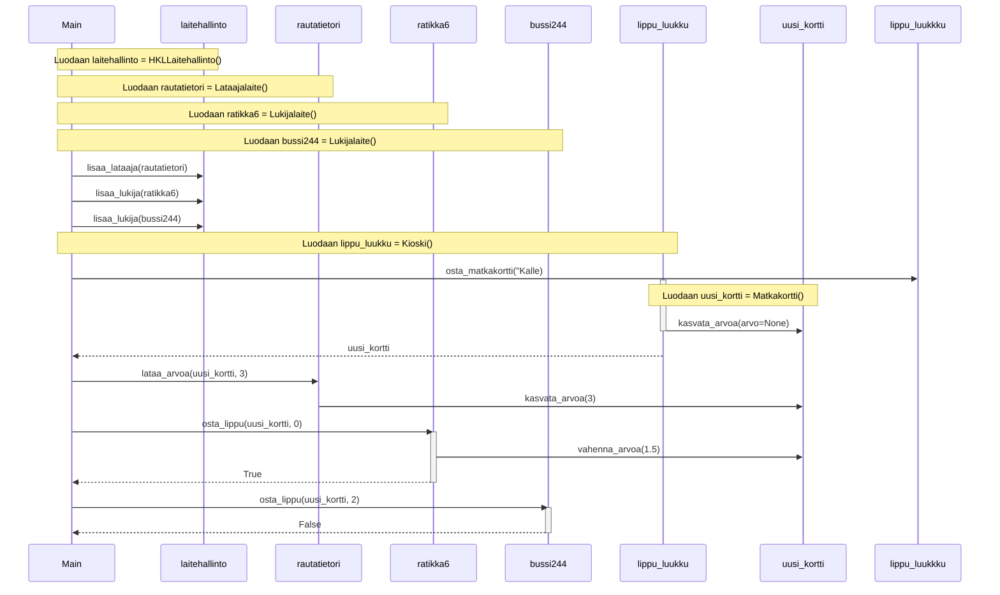

# Tehtävä 4: Laajempi sekvenssikaavio

```mermaid
sequenceDiagram
    participant Main
    participant laitehallinto
    participant rautatietori
    participant ratikka6
    participant bussi244
    participant lippu_luukku
    participant uusi_kortti

    Note over Main,laitehallinto: Luodaan laitehallinto = HKLLaitehallinto()
    Note over Main,rautatietori: Luodaan rautatietori = Lataajalaite()
    Note over Main,ratikka6: Luodaan ratikka6 = Lukijalaite()
    Note over Main,bussi244: Luodaan bussi244 = Lukijalaite()

    Main->>laitehallinto: lisaa_lataaja(rautatietori)
    Main->>laitehallinto: lisaa_lukija(ratikka6)
    Main->>laitehallinto: lisaa_lukija(bussi244)

    Note over Main,lippu_luukku: Luodaan lippu_luukku = Kioski()

    Main->>lippu_luukkku: osta_matkakortti("Kalle)
    activate lippu_luukku
    Note over lippu_luukku,uusi_kortti: Luodaan uusi_kortti = Matkakortti()
    lippu_luukku->>uusi_kortti: kasvata_arvoa(arvo=None)
    deactivate lippu_luukku
    lippu_luukku-->>Main: uusi_kortti

    Main->>rautatietori: lataa_arvoa(uusi_kortti, 3)
    rautatietori->>uusi_kortti: kasvata_arvoa(3)

    Main->>ratikka6: osta_lippu(uusi_kortti, 0)
    activate ratikka6
    ratikka6->>uusi_kortti: vahenna_arvoa(1.5)
    ratikka6-->>Main: True
    deactivate ratikka6

    Main->>bussi244: osta_lippu(uusi_kortti, 2)
    activate bussi244
    bussi244-->>Main: False
    deactivate bussi244
```