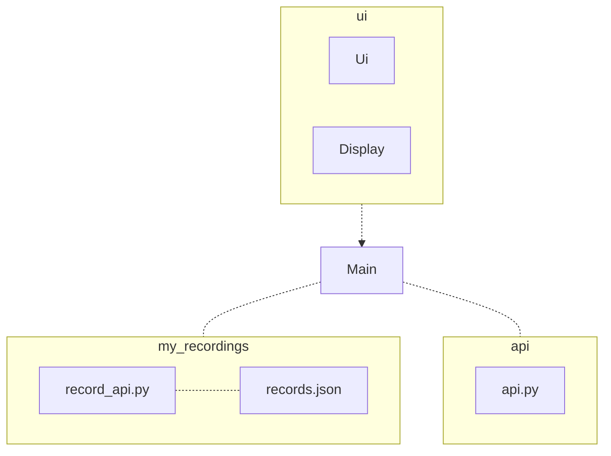
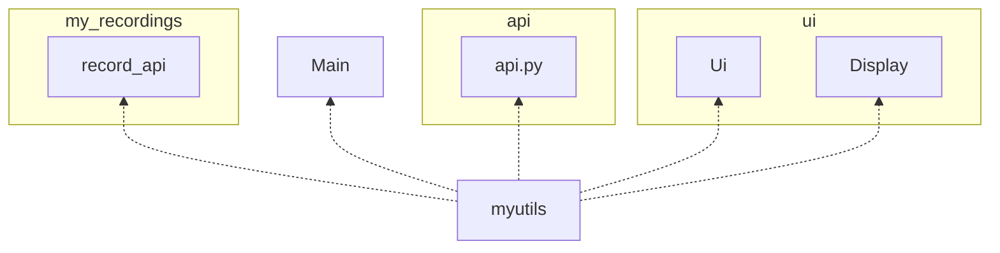
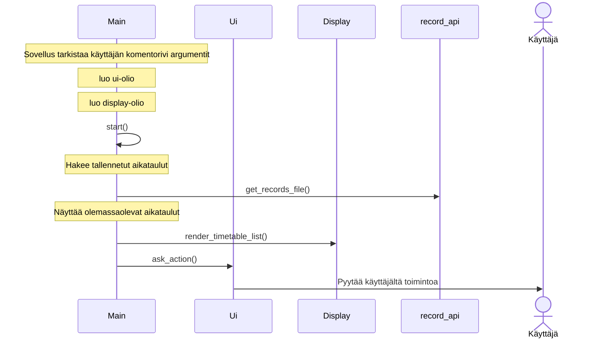
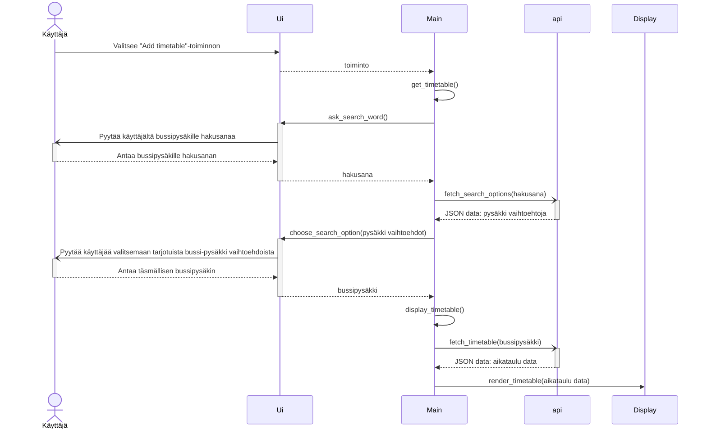
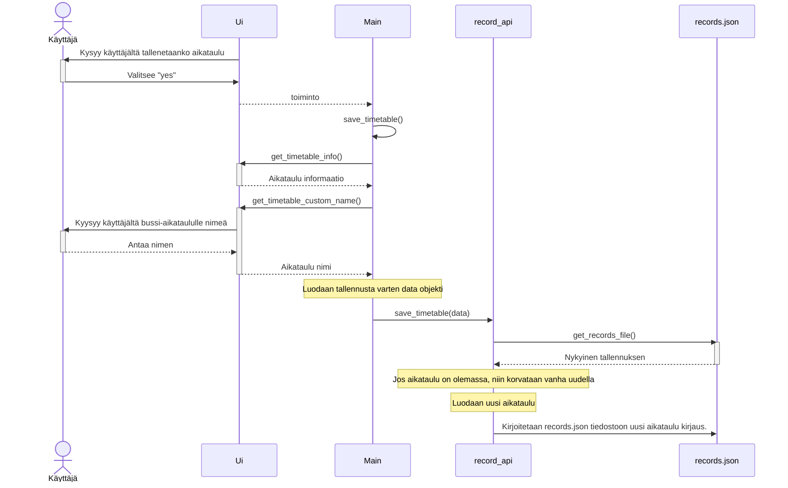

# Arkkirehtuurikuvaus
## Rakenne
Seuraava kaavio havainnollistaa koodin rakennetta ja sen eri luokkien/moduulien yhteyksiä. Pakkausrakenne on seuraavanlainen:

 

### Huomioitavaa
myutils.py sisältää yleisiä työkalu funktioita ja on importattu kaikkiin luokkiin ja moduuleihin

## Käyttöliittymä
Käyttöliittymän päätoimintaperiaate on, että käyttäjä voi tarkastella bussi-aikatauluja, joita hän on itse sovelluksen avulla etsinyt ja tallentanut.
Käyttäjälle tarjotaan myös mahdollisuutta muokata tekemisiään jälkikäteen.

Käyttöliittymä sisältää 3 päänäkymää.
- Etusivu näkymä
- Bussi-aikataulu näkymä
- Hallinta näkymä

### Etusivu näkymä
Tämä näkymä toimii sovelluksen kotivalikkona. Näkymä tarjoaa tietoa siitä, saako sovellus onnistuneesti yhteyden HSL-rajapintaan, paikallisen ajan, valikon siitä mitä käyttäjä haluaa seuraavaksi tehdä ja tallennetut bussi-aikataulut.

### Bussi-aikataulu näkymä
Tämä komponentti on vastuussa ainoastaan bussi-aikataulujen näyttämisestä.

### Hallinta näkymä
Tämä näkymä tarjoaa käyttäjälle mahdollisuuden hallinnoida tallennettuja bussi-aikatauluja, muokkaamalla ja poistamalla näitä jälkikäteen.

 
Näkymät voivat olla näkyvissä yksi kerrallaan tai samanaikaisesti. Käyttöliittymä ohjaa myös käyttäjää eri toiminnoissa eteenpäin vaihe kerrallaan,josta koostuu sovelluksen muut näkymät.

## Sovelluslogiikka
--
## Tietojen pysyväistallennus
Tiedot pysyväistallennetaan sovelluksen mukana tulevaan `records.json` tiedostoon. Tiedosto on sijoitettu `my_recordings` kansioon. Tallennuslogiikasta vastaa samassa kansiossa sijaitseva `records_api.py`. `records_api.py` on käytössä ainoastaan `Main` luokasta.

## Päätoiminnallisuudet
### Alkuvalikko
Kun käyttäjä käynnistää sovelluksen, etenee sovelluksen kontrolli seuraavasti:

 
 

### Bussi-aikataulun hakeminen ja tallentaminen
Bussi-aikataulun hakeminen ja tallentaminen on jaettu kahteen vuokaavioon. 
Ensimmäisenä kuvataan bussi-akataulun hakemista ja toiseksi sen tallentamista pysyväistallennukseen.

### Aikataulun hakeminen
Kun käyttäjä hakee bussi-aikataulua, etenee sovelluksen kontrolli seuraavasti:

#### Aikataulun tallentaminen
Kun käyttäjä tallentaa bussi-aikataulun, etenee sovelluksen kontrolli seuraavasti:

