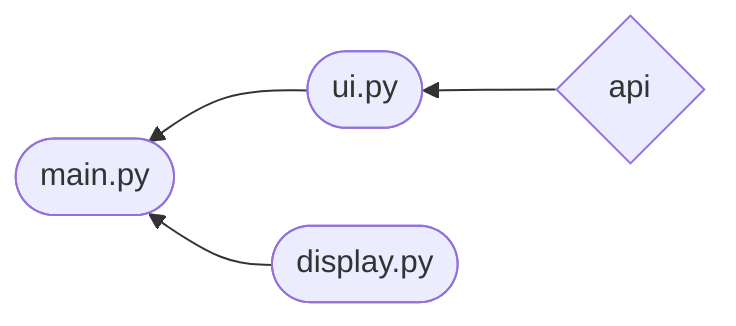
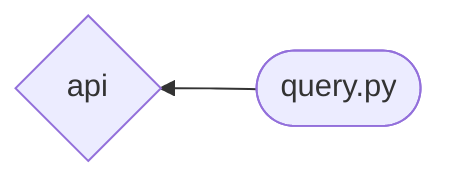

# Arkkirehtuurikuvaus
## Rakenne
Seuraava kaavio havainnollistaa koodin rakennetta ja sen eri tiedostojen yhteyksiä toisiinsa. Nuolen kulku suunta osoittaa missä import lause moduulille tapahtuu.

Koodin tiedosto rakenne on seuraavanlainen.

 

 
 

### Huomioitavaa
myutils.py sisältää yleisiä työkalu funktioita. Jokainen seuraavista tiedostoista sisältää tämän tiedoston.

## Käyttöliittymä
Käyttöliittymän päätoimintaperiaate on, että käyttäjä voi tarkastella bussi-aikatauluja, joita hän on itse sovelluksen avulla etsinyt ja tallentanut.
Käyttäjälle tarjotaan myös mahdollisuutta muokata tekemisiään jälkikäteen.

Käyttöliittymä sisältää viisi eri komponenttia.
- Etusivu näkymä
- Bussi-aikataulu näkymä
- Valikointi näkymä
- Syöte näkymä
- Hallinta näkymä

### Etusivu näkymä
Tämä näkymä on sovelluksen ensimmäinen näkymä. Se näyttää tietoja siitä saako sovellus onnistuneesti yhteyden HSL-rajapintaan, paikallisen ajan, valikon siitä mitä käyttäjä haluaa seuraavaksi tehdä ja tallennetut bussi-aikataulut.

### Bussi-aikataulu näkymä
Tämä komponentti on vastuussa ainoastaan bussi-aikataulun näyttämisestä.

### Valikointi näkymä
Tämä komponentti antaa käyttäjälle eri toiminta vaihtoehtoja. Esimerkiksi mitä hän haluaisi seuraavaksi sovelluksessa tehdä.

### Syöte näkymä
Tämä komponentti pyytää käyttäjältä tekstisyötettä. Esimerkiksi bussipysäkin nimeä.

### Hallinta näkymä
Tämä näkymä tarjoaa käyttäjälle mahdollisuuden hallinnoida tallennettuja bussi-aikatauluja, muokkaamalla ja poistamalla näitä.

Näkymät voivat olla näkyvissä yksikerrallaan tai samanaikaisesti.