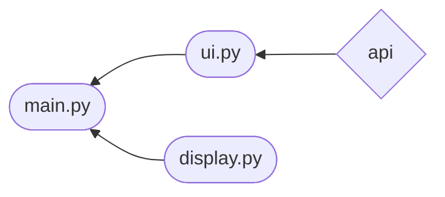

# Arkkirehtuurikuvaus
## Rakenne
Seuraava kaavio havainnollistaa koodin rakennetta ja sen eri tiedostojen yhteyksiä toisiinsa. Nuolen kulku suunta osoittaa missä import lause moduulille tapahtuu.

Koodin tiedosto rakenne on seuraavanlainen.

 

 
 

### Huomioitavaa
myutils.py sisältää yleisiä työkalu funktioita. Jokainen seuraavista tiedostoista sisältää tämän tiedoston.

## Käyttöliittymä