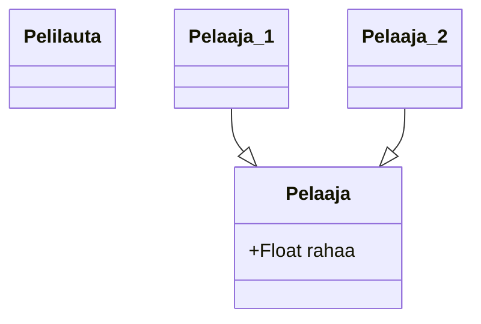
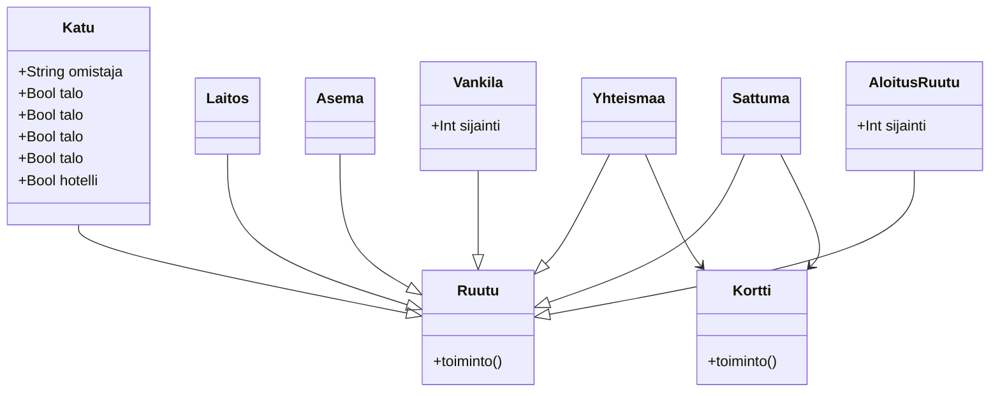

# Tehtävä 2: Laajennettu Monopoli

```mermaid
classDiagram
    class Pelilauta
    class Pelaaja

    Pelaaja : +Float rahaa

    Pelaaja_1 --|> Pelaaja
    Pelaaja_2 --|> Pelaaja
```

```mermaid
classDiagram
    class Ruutu
    class AloitusRuutu
    class Kortti

    Ruutu : +toiminto()
    Kortti : +toiminto()

    Sattuma --> Kortti
    Yhteismaa --> Kortti

    AloitusRuutu --|> Ruutu
    Vankila --|> Ruutu
    Sattuma --|> Ruutu
    Yhteismaa --|> Ruutu
    Asema --|> Ruutu
    Laitos --|> Ruutu
    Katu --|> Ruutu

    AloitusRuutu : +Int sijainti
    Vankila : +Int sijainti

    Katu : +String omistaja
    Katu : +Bool talo
    Katu : +Bool talo
    Katu : +Bool talo
    Katu : +Bool talo
    Katu : +Bool hotelli
```