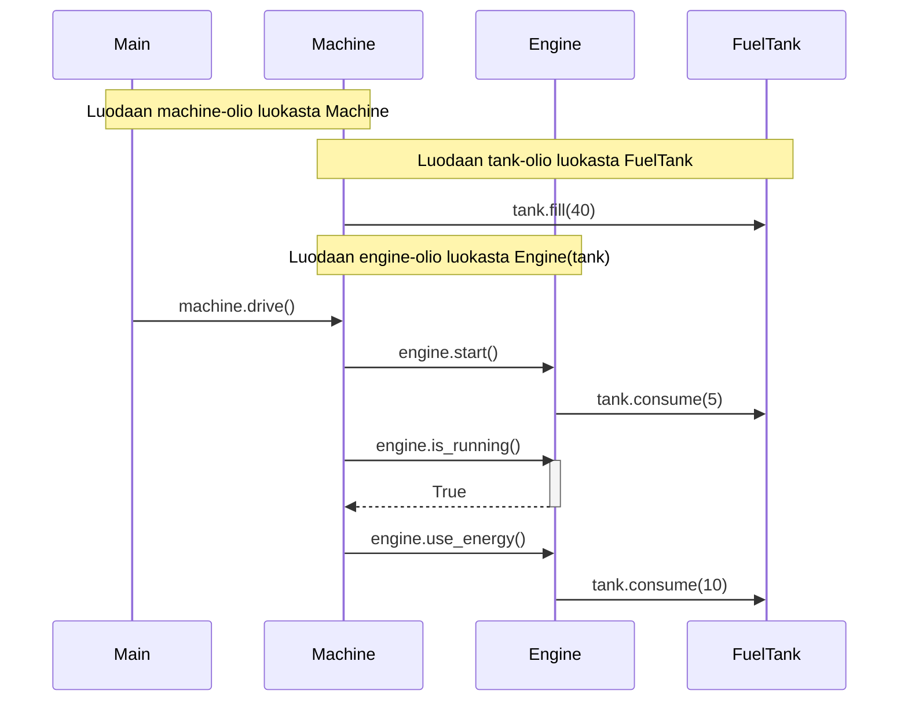

# Tehtävä 3: Sekvenssikaavio

```mermaid
sequenceDiagram
    participant Main
    participant Machine
    participant Engine
    participant FuelTank

    Note over Main,Machine: Luodaan machine-olio luokasta Machine

    Note  over Machine,FuelTank: Luodaan tank-olio luokasta FuelTank
    Machine->>FuelTank: tank.fill(40)
    Note over Machine,Engine: Luodaan engine-olio luokasta Engine(tank)

    Main->>Machine: machine.drive()
    
    Machine->>Engine: engine.start()
    Engine->>FuelTank: tank.consume(5)

    Machine->>Engine: engine.is_running()
    activate Engine
    Engine-->>Machine: True
    deactivate Engine

    %% if running
    Machine->>Engine: engine.use_energy()
    Engine->>FuelTank: tank.consume(10)
```